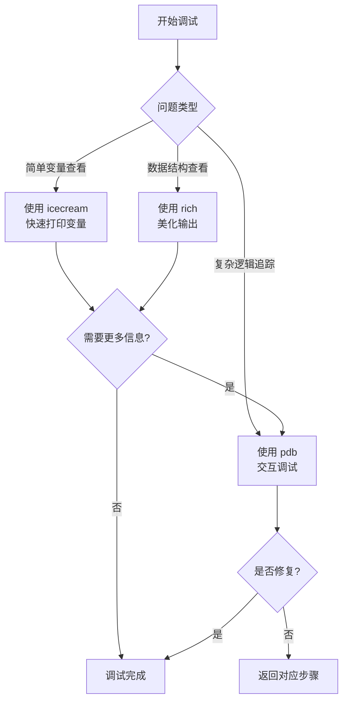

# 🎯 调试三剑客：icecream + rich + pdb 深度指南

这三个工具覆盖了调试的**三个层级**：快速打印、可视化增强、交互式调试。

## 🧊 **icecream - 智能打印**

### 核心功能：让`print`调试变得更聪明

```python
from icecream import ic

# 1. 基本用法 - 自动显示变量名
user = {"name": "Alice", "age": 25}
x = 42
ic(user)    # ic| user: {'name': 'Alice', 'age': 25}
ic(x)       # ic| x: 42

# 2. 表达式计算
ic(user["name"].upper())  # ic| user["name"].upper(): 'ALICE'
ic(len(user))            # ic| len(user): 2

# 3. 函数调用追踪
def process_data(data):
    ic()  # 标记执行位置
    result = data * 2
    ic(result)
    return result

process_data(5)  # 输出两次：位置标记和结果

# 4. 包含上下文信息
ic.configureOutput(prefix="DEBUG| ", includeContext=True)
ic(x)  # DEBUG| example.py:12 in <module> - x: 42
```

### 🎯 **实际应用场景**

1. **API响应调试**
```python
# 传统方式
print(f"Response status: {response.status_code}")
print(f"Response data: {response.json()}")

# icecream方式
ic(response.status_code, response.json())
```

2. **循环内部状态追踪**
```python
results = []
for i in range(3):
    data = fetch_data(i)
    ic(i, data)  # 同时看到索引和值
    results.append(process(data))
```

3. **条件调试**
```python
# 只在特定条件下输出
debug_mode = True
ic.configureOutput(enabled=debug_mode)
```

## 🎨 **rich - 美化调试输出**

### 核心功能：让调试信息可读性提升10倍

```python
from rich.console import Console
from rich.table import Table
from rich.tree import Tree
from rich.syntax import Syntax
from rich import print as rprint

console = Console()

# 1. 数据结构可视化
data = {
    "api_response": {
        "users": [
            {"id": 1, "name": "Alice", "role": "admin"},
            {"id": 2, "name": "Bob", "role": "user"}
        ],
        "meta": {"page": 1, "total": 100}
    }
}
rprint(data)  # 自动缩进+颜色高亮

# 2. 表格展示数据
def debug_sql_results(results):
    table = Table(title="Query Results", show_lines=True)
    table.add_column("ID", style="cyan")
    table.add_column("Name", style="magenta")
    table.add_column("Status", style="green")
    
    for row in results:
        table.add_row(str(row.id), row.name, row.status)
    console.print(table)

# 3. 语法高亮代码片段
code = """
def complex_function():
    data = fetch_from_api()
    processed = transform(data)
    return processed
"""
console.print(Syntax(code, "python", theme="monokai"))

# 4. 树形结构展示
def debug_file_structure(path):
    tree = Tree(f"📁 {path}")
    for item in Path(path).iterdir():
        if item.is_dir():
            branch = tree.add(f"📁 {item.name}")
            for sub in item.iterdir():
                branch.add(f"📄 {sub.name}")
        else:
            tree.add(f"📄 {item.name}")
    console.print(tree)
```

### 🎯 **实际应用场景**

1. **数据库查询调试**
```python
def debug_query(query, params=None):
    console.rule("[bold red]SQL DEBUG")
    console.print(f"[cyan]Query:[/cyan] {query}")
    if params:
        console.print(f"[cyan]Params:[/cyan] {params}")
    
    # 执行查询并显示结果
    results = execute_query(query, params)
    
    table = Table(show_header=True, header_style="bold magenta")
    for col in results[0].keys():
        table.add_column(col)
    
    for row in results:
        table.add_row(*[str(v) for v in row.values()])
    console.print(table)
    console.rule()
```

2. **API请求/响应追踪**
```python
def debug_api_call(url, method, payload):
    console.rule(f"[bold]{method} {url}")
    console.print("[yellow]Request:[/yellow]")
    rprint(payload)
    
    response = requests.request(method, url, json=payload)
    
    console.print(f"\n[green]Response ({response.status_code}):[/green]")
    if response.headers.get('content-type', '').startswith('application/json'):
        rprint(response.json())
    else:
        console.print(response.text[:500])
    return response
```

3. **管道数据处理调试**
```python
def debug_data_pipeline(data, steps):
    console.print("[bold blue]Data Pipeline Debug[/bold blue]")
    
    for i, (step_name, step_func) in enumerate(steps, 1):
        console.rule(f"Step {i}: {step_name}")
        console.print("[dim]Input shape:[/dim]", data.shape)
        
        data = step_func(data)
        
        console.print("[dim]Output sample:[/dim]")
        console.print(data[:3] if len(data) > 3 else data)
        console.print()
```

## 🔧 **pdb - 交互式深度调试**

### 核心功能：在问题最深处暂停并探索

```python
# Python 3.7+ 推荐方式
import pdb

def problematic_function(data):
    result = []
    
    # 1. 简单断点
    breakpoint()  # 等价于 pdb.set_trace()
    
    for item in data:
        # 2. 条件断点
        if item > 100:
            breakpoint()  # 只在特定条件下触发
        
        processed = complex_calculation(item)
        result.append(processed)
    
    return result
```

### 📋 **pdb 核心命令速查**

```bash
# 基本导航
n(ext)      # 执行下一行
s(tep)      # 进入函数内部
c(ontinue)  # 继续执行到下一个断点
r(eturn)    # 执行到当前函数返回
q(uit)      # 退出调试

# 查看代码
l(ist)      # 显示当前代码位置
w(here)     # 显示调用栈
u(p)        # 向上移动调用栈
d(own)      # 向下移动调用栈

# 检查变量
p <expr>    # 打印表达式
pp <expr>   # 漂亮打印
whatis <var> # 查看变量类型

# 操作变量
!<stmt>     # 执行Python语句
<var> = <val> # 修改变量值

# 断点管理
b(reak) [lineno|function]  # 设置断点
cl(ear) [bpnumber]         # 清除断点
disable [bpnumber]         # 禁用断点
enable [bpnumber]          # 启用断点
```

### 🎯 **实际应用场景**

1. **异步代码调试**
```python
import asyncio
import pdb

async def fetch_concurrently(urls):
    results = []
    for url in urls:
        response = await fetch(url)
        if response.status != 200:
            # 在异步环境中调试
            await pdb.AsyncPdb().set_trace()
        results.append(response)
    return results
```

2. **复杂条件断点**
```python
def process_batch(batch):
    for i, item in enumerate(batch):
        # 只在特定条件下中断
        if item.error_count > 5 and i > 10:
            import pdb
            pdb.set_trace()
        
        # 或者通过代码动态控制
        if should_debug(item):
            breakpoint()
```

3. **Post-mortem调试**（程序崩溃后）
```python
# 方法1：命令行启动
# python -m pdb -c continue script.py

# 方法2：在代码中捕获异常
import pdb, traceback

def main():
    try:
        risky_operation()
    except Exception:
        traceback.print_exc()
        pdb.post_mortem()  # 进入崩溃现场
```

## 💡 **三剑客组合技**

### 场景1：复杂数据处理管道调试
```python
from icecream import ic
from rich.console import Console
import pdb

console = Console()

def debug_pipeline(data, stages):
    """组合调试：用icecream快速打印，rich可视化，pdb深度调试"""
    
    ic.configureOutput(prefix="🚀 ", includeContext=True)
    
    for stage_name, stage_func in stages:
        console.rule(f"[bold]{stage_name}")
        
        # 1. icecream快速检查输入
        ic("Stage input shape:", data.shape)
        
        try:
            # 2. rich可视化数据样本
            if hasattr(data, 'head'):
                table = Table(title="Data Sample")
                for col in data.columns[:3]:
                    table.add_column(col)
                for row in data.head(3).itertuples(index=False):
                    table.add_row(*[str(v) for v in row[:3]])
                console.print(table)
            
            # 处理
            data = stage_func(data)
            
            # 3. 检查结果
            ic("Stage output shape:", data.shape)
            
        except Exception as e:
            # 4. 出错时用rich显示错误，pdb调试
            console.print(f"[bold red]Error in {stage_name}:[/bold red]")
            console.print(f"[red]{e}[/red]")
            
            # 进入调试模式
            console.print("\n[yellow]Entering debug mode...[/yellow]")
            breakpoint()  # 在这里检查变量状态
            
    return data
```

### 场景2：Web应用请求调试
```python
from icecream import ic
from rich.console import Console
from rich.table import Table
import pdb

console = Console()

def debug_middleware(request):
    """调试Django/Flask中间件"""
    
    # icecream：记录基本信息
    ic(request.method, request.path, request.user)
    
    # rich：美化显示请求头
    if ic.enabled:  # 只在调试模式显示详细内容
        table = Table(title="Request Headers")
        table.add_column("Header")
        table.add_column("Value")
        
        for key, value in request.headers.items():
            table.add_row(key, value)
        console.print(table)
    
    # 处理请求...
    response = process_request(request)
    
    # 如果响应异常，进入pdb调试
    if response.status_code >= 400:
        console.print(f"[red]Error response: {response.status_code}[/red]")
        console.print(f"[red]Content: {response.content[:200]}[/red]")
        
        # 设置条件断点
        if response.status_code == 500:
            breakpoint()  # 调试500错误
    
    return response
```

### 场景3：数据竞赛/分析调试
```python
from icecream import ic
import pandas as pd
import numpy as np
from rich.console import Console
from rich.table import Table
import pdb

console = Console()

def debug_feature_engineering(df):
    """调试特征工程步骤"""
    
    console.rule("[bold blue]Feature Engineering Debug[/bold blue]")
    
    # 1. 初始数据概览
    ic("原始数据形状:", df.shape)
    ic("列名:", df.columns.tolist())
    
    # 2. 用rich显示统计信息
    table = Table(title="数据统计")
    table.add_column("Column")
    table.add_column("Type")
    table.add_column("Missing")
    table.add_column("Unique")
    
    for col in df.columns:
        table.add_row(
            col,
            str(df[col].dtype),
            str(df[col].isna().sum()),
            str(df[col].nunique())
        )
    console.print(table)
    
    # 3. 逐步处理特征
    for feature_func in feature_functions:
        try:
            df = feature_func(df)
            ic(f"After {feature_func.__name__}:", df.shape)
            
            # 检查异常值
            numeric_cols = df.select_dtypes(include=[np.number]).columns
            for col in numeric_cols[:3]:  # 只检查前3个数值列
                q1 = df[col].quantile(0.25)
                q3 = df[col].quantile(0.75)
                iqr = q3 - q1
                outliers = df[(df[col] < q1 - 1.5*iqr) | (df[col] > q3 + 1.5*iqr)]
                
                if len(outliers) > 0:
                    console.print(f"[yellow]⚠️  {col} 有 {len(outliers)} 个异常值[/yellow]")
                    
        except Exception as e:
            console.print(f"[red]Error in {feature_func.__name__}: {e}[/red]")
            pdb.set_trace()  # 深入调试
    
    return df
```

## 🎪 **配置建议**

### `.pdbrc` 配置文件（pdb增强）
```python
# ~/.pdbrc
alias ll !__import__("pprint").pprint(%1)
alias dt !__import__("datetime").datetime
alias np !__import__("numpy")
alias pd !__import__("pandas")

# 美化显示
import sys
try:
    from rich import pretty
    pretty.install()
    from rich import print as rprint
except ImportError:
    pass
```

### 项目级调试配置
```python
# debug_utils.py
import os
from functools import wraps

DEBUG = os.getenv("DEBUG", "false").lower() == "true"

def debug_mode(func):
    """装饰器：只在调试模式下启用icecream和rich"""
    @wraps(func)
    def wrapper(*args, **kwargs):
        if DEBUG:
            from icecream import ic
            from rich.console import Console
            console = Console()
            
            console.rule(f"[bold]Entering {func.__name__}")
            ic("Args:", args)
            ic("Kwargs:", kwargs.keys() if kwargs else None)
        
        result = func(*args, **kwargs)
        
        if DEBUG:
            ic(f"{func.__name__} returned:", result)
            console.rule(f"[bold]Exiting {func.__name__}")
        
        return result
    return wrapper
```

## 📊 **使用决策树**



## 🎯 **最佳实践建议**

1. **icecream 用于日常开发**：替换所有`print()`语句
2. **rich 用于代码审查/分享**：生成可读的调试报告
3. **pdb 用于疑难杂症**：当逻辑复杂或需要现场探索时
4. **组合使用规则**：
   - 先`ic()`快速定位大致位置
   - 用`rich`查看数据结构
   - 在关键位置用`breakpoint()`深入
5. **调试会话示例**：
```python
# 发现bug -> 快速定位
ic(suspect_variable)  # 立即知道哪个变量有问题

# 查看详情 -> 美化展示
from rich import print
print(complex_data_structure)  # 清晰查看结构

# 深入分析 -> 交互调试
breakpoint()  # 在这里探索各种可能性
!suspect_variable = 42  # 尝试修复
c  # 继续执行看效果
```

**记住**：好的调试工具应该让你思考问题本身，而不是工具如何使用。这三个工具正是为此设计——`icecream`减少输入，`rich`减少理解成本，`pdb`提供无限探索能力。